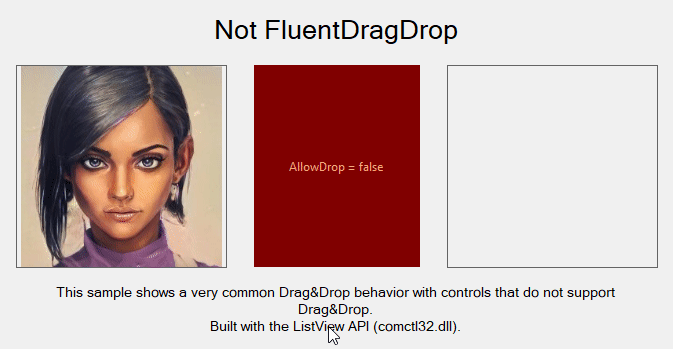
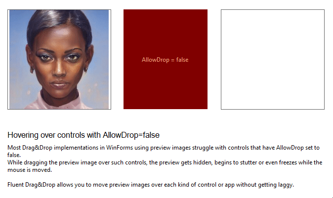

# Fluent Drag&Drop

[](https://www.nuget.org/packages/FluentDragDrop/)

Drag&Drop in WinForms is cumbersome and error-prone. There are multiple events to handle, members to track and properties to set on at least two controls. Passing data is kind of special and you don't get preview images while dragging things around.

Wouldn't it be great if you could use Drag&Drop with fluent code like this?

<!-- snippet: Usage -->
<a id='snippet-usage'></a>
```cs
private void picControlPreviewBehindCursor_MouseDown(object sender, MouseEventArgs e)
{
    var pic = (PictureBox)sender;

    pic.InitializeDragAndDrop()
        .Copy()
        .Immediately()
        .WithData(pic.Image)
        .WithPreview().BehindCursor()
        .To(PreviewBoxes, (target, data) => target.Image = data);

    // Copy(), Move() or Link() to define allowed effects
    // Immediately() or OnMouseMove() for deferred start on mouse move
    // WithData() to pass any object you like
    // WithPreview() to define your preview and how it should behave
    //     BehindCursor() or RelativeToCursor() to define the preview placement
    // To() to define target controls and how the dragged data should be used on drop
}
```
<sup><a href='/src/FluentDragDropExample/TestForm.cs#L29-L48' title='File snippet `usage` was extracted from'>snippet source</a> | <a href='#snippet-usage' title='Navigate to start of snippet `usage`'>anchor</a></sup>
<!-- endSnippet -->

It's all in there: Putting data to the drag&drop operation, attaching a custom preview image to the mouse cursor, working with the dragged data once it's dropped and much more.


> Did you notice that you can even update preview images and their opacity at any time while dragging? 😉

### Compatibility

FluentDrag&Drop can easily be used with your current Drag&Drop implementations if you want. The following animation shows how it works in combination with traditional Drag&Drop implementations as we know with events like `DragEnter`, `DragOver` and `DragDrop`:


### Smoothness

Most approaches I have used in the past get in trouble when moving the preview over controls that do not have the property `AllowDrop` set to `true`. Whenever a Drag&Drop implementation uses the `GiveFeedback` event to update its preview images, you'll get a behavior like this:



In contrast, FluentDrag&Drop will render preview images smoothly wherever you move them.


