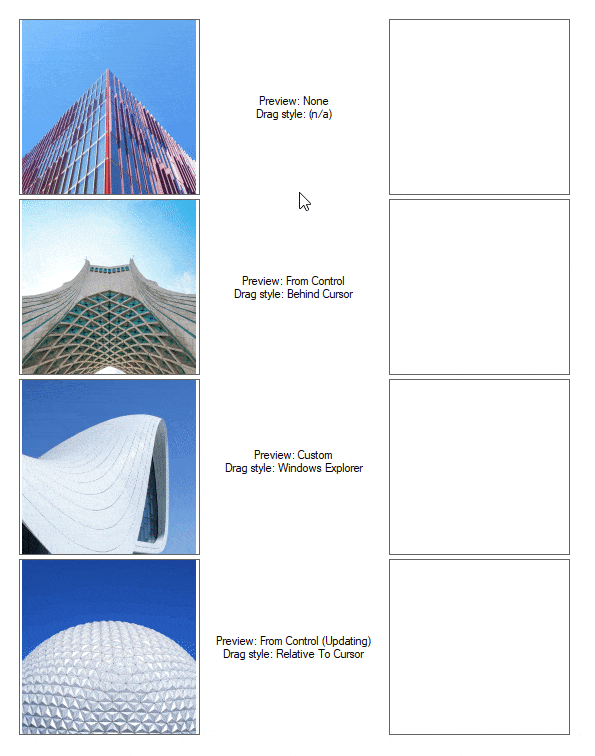
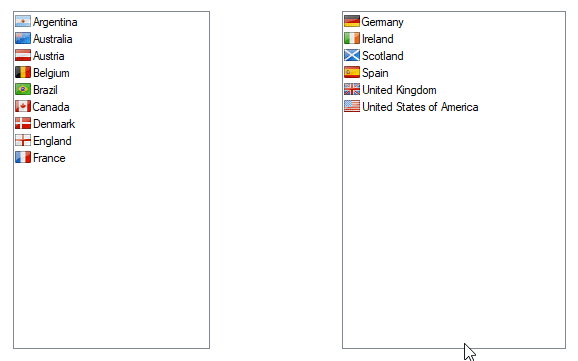
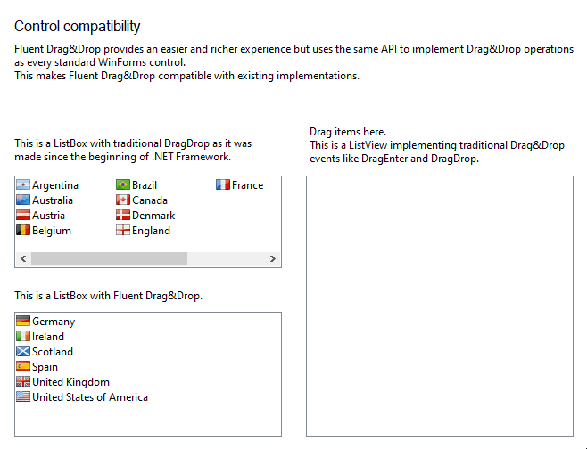
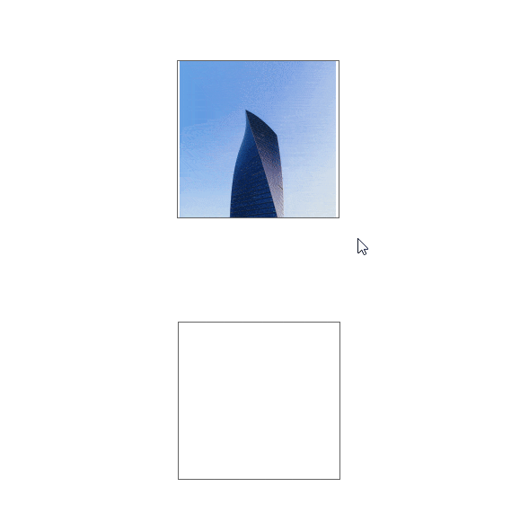

# Fluent Drag&Drop

[](https://www.nuget.org/packages/FluentDragDrop/) <sup>[🔆 Now with effects](#-effects)</sup>

Drag&Drop in WinForms is cumbersome and error-prone. There are multiple events to handle, members to track and properties to set on at least two controls. Passing data is kind of special and you don't get preview images while dragging things around.

Wouldn't it be great if you could use Drag&Drop with fluent code like this?

<!-- snippet: ImmediateUsage -->
<a id='snippet-ImmediateUsage'></a>
```cs
private void picControlPreviewBehindCursor_MouseDown(object sender, MouseEventArgs e)
{
	var pic = (PictureBox)sender;

	pic.InitializeDragAndDrop()
		.Copy()
		.Immediately()
		.WithData(pic.Image)
		.WithPreview().BehindCursor()
		.To(PreviewBoxes, (target, data) => target.Image = data);

	// Copy(), Move() or Link() to define allowed effects
	// Immediately() or OnMouseMove() for deferred start on mouse move
	// WithData() to pass any object you like
	// WithPreview() to define your preview and how it should behave
	//     BehindCursor() or RelativeToCursor() to define the preview placement
	// To() to define target controls and how the dragged data should be used on drop
}
```
<sup><a href='/src/FluentDragDropExample/TestForm.cs#L32-L51' title='Snippet source file'>snippet source</a> | <a href='#snippet-ImmediateUsage' title='Start of snippet'>anchor</a></sup>
<!-- endSnippet -->

It's all in there: Putting data to the drag&drop operation, attaching a custom preview image to the mouse cursor, working with the dragged data once it's dropped and much more.



> Did you notice that you can even update preview images and their opacity at any time while dragging? 😉

## Perfect by default

In real world apps, Drag&Drop should not start at MouseDown because the control selection might not be up to date to the mouse interaction. Instead, developers typically have to keep track that MouseDown did happen and add an additional event handler to MouseMove. If MouseMove is triggered and there was a MouseDown but no MouseUp, the user pressed the mouse button and moved the mouse. So that's when he wanted to start a Drag&Drop operation.

Careful developers won't track a flag whether the mouse button is still down or not but the location where the user pressed the button. On MouseMove, they can then calculate the distance how much the cursor did move. Having a few pixels buffer here helps to prevent the user from accidential Drag&Drop operations. 

FluentDrag&Drop does exactly that if defined with `OnMouseMove()`. However there is no flag or location to track. Methods like `WithData()` won't accept direct variables to be passed anymore, instead they require a function which gets called as soon as the mouse move is detected later on - if the user pressed and held the mouse button and if he moved a few pixels. Additionally, the developer has the possibility to validate the input like a valid control selection with `If()`. Of course, this gets called just like `WithData()` as soon as the user moves the mouse accordingly:

<!-- snippet: DelayedUsage -->
<a id='snippet-DelayedUsage'></a>
```cs
private void CountryList_MouseDown(object sender, MouseEventArgs e)
{
	var source = (ListView)sender;
	var target = source.Equals(listLeft) ? listRight : listLeft;

	source.InitializeDragAndDrop()
		.Move()
		.OnMouseMove()
		.If(() => source.SelectedIndices.Count > 0)
		.WithData(() => source.SelectedItems.OfType<ListViewItem>().ToArray())
		.WithPreview((_, data) => RenderPreview(data)).BehindCursor()
		.To(target, MoveItems);
}
```
<sup><a href='/src/FluentDragDropExample/TestForm.cs#L80-L94' title='Snippet source file'>snippet source</a> | <a href='#snippet-DelayedUsage' title='Start of snippet'>anchor</a></sup>
<!-- endSnippet -->

This (<sub><sup>and the 5 line method `MoveItems()`</sub></sup>) is everything we need to implement two-way Drag&Drop lists:



## Compatibility

FluentDrag&Drop can easily be used with your current Drag&Drop implementations if you want. The following animation shows how it works in combination with traditional Drag&Drop implementations as we know with events like `DragEnter`, `DragOver` and `DragDrop`:



## Smoothness

Most approaches I have used in the past get in trouble when moving the preview over controls that do not have the property `AllowDrop` set to `true`. Whenever a Drag&Drop implementation uses the `GiveFeedback` event to update its preview images, you might get laggy Drag&Drop experiences with stuttering preview image movements.

In contrast, FluentDrag&Drop will render preview images smoothly wherever you move them, even over other applications.

## 🔆 Effects

To make your drag and drop implementation even more impressive, this repository also contains a project called "FluentDragDrop.Effects". It is part of the FluentDrag&Drop solution but builds to a separate and optional package which extends FluentDrag&Drop with a set of default effects.

Some of these effects are: 
- FadeIn
- FadeOut
- ReturnOnCancel
- MorphToTarget



The sample above shows some of the effects in action:
- FadeIn on start
- ReturnOnCancel when dropping next to the empty box
- MorphToTarget when dropping into the empty box
  - this effect is accompanied by an additional effect implemented in the sample app causing the box to fade a color

### FluentTransitions

Those effects are powered by another project called [FluentTransitions](https://github.com/awaescher/FluentTransitions) allowing the animations and transitions to be rendered smoothly. I'd encourage you to check it out:
- [GitHub](https://github.com/awaescher/FluentTransitions)
- [NuGet](https://www.nuget.org/packages/FluentTransitions)

---

Images taken from Unsplash, links to these are located at [/doc/Unsplash](/doc/Unsplash).